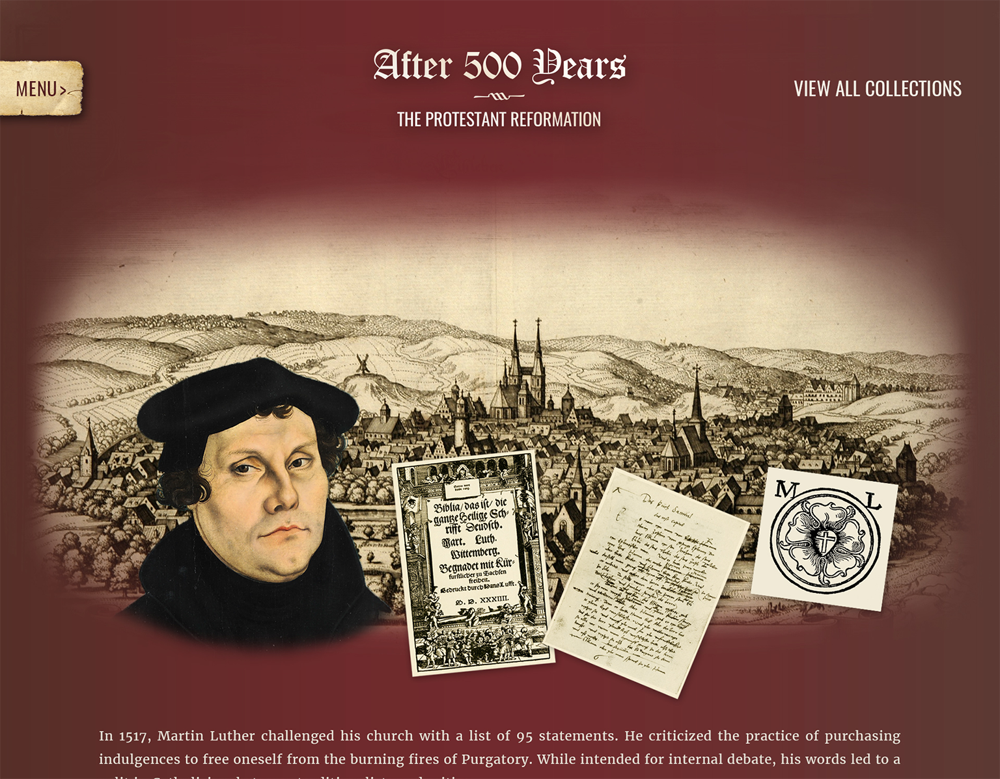

# University of Arizona Libraries - Reformation 500 Omeka Exhibit Theme

## Getting started

Install the dependencies: `npm install`

## Scripts

You can build the project with [Webpack](https://webpack.github.io/) by running
`npm run build:prod` (builds for production) or `npm run build:dev` (builds for development).

This project uses [JavaScript Standard Style](https://standardjs.com/).
Test it by running `npm test`. Lint it by running `npm run lint`.

## Learn more

* [PostCSS](http://postcss.org/) and [CSSNext](http://cssnext.io/)
* [Babel](https://babeljs.io/)
* [Webpack](https://webpack.js.org/)
* [JavaScript Standard Style](https://standardjs.com/)
* [Travis CI](https://travis-ci.org/)
